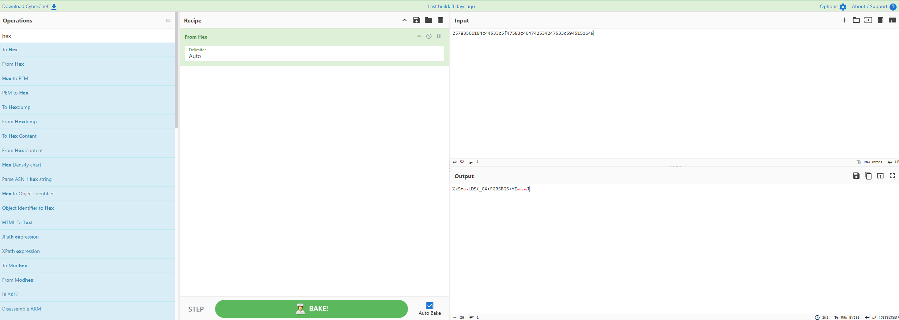
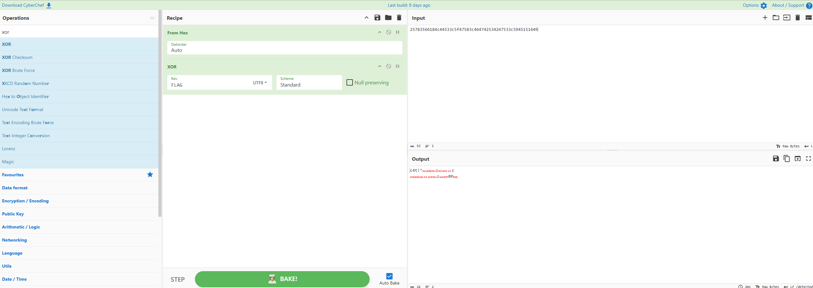
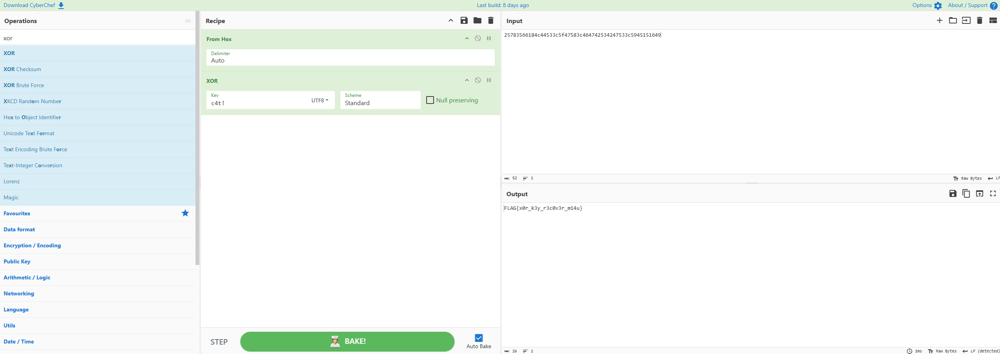

# Acesso Exclusivo (Escolinha CTF)

**Categoria:** Crypto  
**Autor:** Felipe Morais

## Introdução

O **Acesso Exclusivo** é um desafio da categoria Crypto presente na plataforma **Escolinha CTF**. O objetivo consiste em analisar um arquivo cifrado e explorar as propriedades matemáticas da operação lógica **XOR** (*Exclusive OR*, ou “Ou Exclusivo”) para reverter a criptografia e recuperar a flag.

O desafio demonstra como uma cifra baseada em XOR pode ser comprometida quando utiliza uma chave curta e repetida sobre um texto cujo formato inicial é conhecido.

## Análise Inicial

O enunciado apresentado pelo desafio fornece uma pista direta sobre o método de criptografia utilizado:

> A lógica do algoritmo invasor é simples: “ou é uma coisa, ou é outra, mas nunca as duas”. Use esse conhecimento contra a própria cifra para quebrar a criptografia.

Também foram fornecidas as seguintes informações:

- Modelo de flag: `FLAG{...}`
- Arquivo anexado: `flag.txt`

Ao abrir o arquivo `flag.txt`, encontramos a seguinte sequência hexadecimal:

```text
25783566184c44533c5f47583c464742534247533c5945151649
```

A expressão “ou é uma coisa, ou é outra, mas nunca as duas” descreve diretamente o comportamento da operação lógica XOR.

## Interpretação

A operação XOR possui uma característica fundamental: ela pode ser revertida quando aplicada novamente com a mesma chave.

Se:

```text
TextoClaro XOR Chave = TextoCifrado
```

então:

```text
TextoCifrado XOR Chave = TextoClaro
```

Também é possível recuperar a chave quando conhecemos uma parte do texto original:

```text
TextoCifrado XOR TextoClaro = Chave
```

Como as flags da plataforma começam com o padrão `FLAG{`, podemos utilizar esse prefixo para realizar um **ataque de texto claro conhecido** (*Known Plaintext Attack*).

A hipótese é que o arquivo contém uma mensagem cifrada com uma chave XOR curta e repetida. Comparando os primeiros bytes cifrados com o início conhecido da flag, podemos descobrir a chave e aplicá-la sobre toda a mensagem.

A estratégia adotada foi:

1. Extrair a sequência hexadecimal do arquivo `flag.txt`.
2. Converter o hexadecimal em bytes utilizando o CyberChef.
3. Aplicar XOR utilizando o trecho conhecido `FLAG`.
4. Identificar a chave produzida pela operação.
5. Aplicar a chave encontrada sobre toda a mensagem cifrada.
6. Recuperar a flag.

## Resolução

### 1. Convertendo o hexadecimal

A sequência encontrada no arquivo foi inserida no campo **Input** do CyberChef:

```text
25783566184c44533c5f47583c464742534247533c5945151649
```

Em seguida, adicionamos à receita a operação:

```text
From Hex
```

Essa operação interpreta cada par de caracteres hexadecimais como um byte.



*Conversão da sequência hexadecimal em bytes utilizando a operação `From Hex`.*

### 2. Recuperando a chave

Sabemos que os quatro primeiros caracteres do texto original são:

```text
FLAG
```

Em hexadecimal, esses caracteres correspondem a:

```text
F = 0x46
L = 0x4c
A = 0x41
G = 0x47
```

Os quatro primeiros bytes do texto cifrado são:

```text
0x25 0x78 0x35 0x66
```

Aplicando XOR entre cada byte cifrado e seu respectivo caractere conhecido:

```text
0x25 XOR 0x46 = 0x63 = c
0x78 XOR 0x4c = 0x34 = 4
0x35 XOR 0x41 = 0x74 = t
0x66 XOR 0x47 = 0x21 = !
```

O resultado revela a chave:

```text
c4t!
```

No CyberChef, adicionamos a operação `XOR` e utilizamos `FLAG` como texto conhecido. O início do resultado mostra `c4t!`, confirmando os quatro bytes da chave.



*Aplicação do prefixo conhecido `FLAG` para recuperar os primeiros bytes da chave XOR, revelando `c4t!`.*

Como a mensagem possui mais bytes do que a chave, ela é aplicada repetidamente:

```text
c4t!c4t!c4t!c4t!c4t!...
```

### 3. Decifrando a mensagem

Depois de recuperar a chave, configuramos a receita final do CyberChef da seguinte maneira:

```text
From Hex
XOR — chave: c4t!
```

A chave foi inserida como texto com codificação `UTF-8`, utilizando o esquema padrão da operação XOR.

Ao aplicar a receita sobre toda a sequência, o texto original foi recuperado:

```text
FLAG{x0r_k3y_r3c0v3r_m14u}
```



*Resultado final após aplicar a chave repetida `c4t!` sobre a mensagem cifrada.*

## Flag

```text
FLAG{x0r_k3y_r3c0v3r_m14u}
```

## Conclusão

O desafio **Acesso Exclusivo** demonstra a fragilidade de utilizar uma chave XOR curta e repetida para proteger informações.

Embora a operação XOR seja um componente importante de diversos algoritmos criptográficos, sua segurança depende da forma como a chave é produzida e utilizada. Neste caso, o formato conhecido da flag permitiu comparar uma parte do texto cifrado com o texto claro esperado.

Utilizando o prefixo `FLAG`, recuperamos a chave `c4t!`. Como essa chave era repetida durante toda a criptografia, foi possível aplicá-la sobre a sequência completa e recuperar a mensagem original.

O desafio reforça dois conceitos importantes:

- uma chave curta e repetida pode produzir padrões exploráveis;
- textos com estruturas previsíveis facilitam ataques de texto claro conhecido.

Para uma utilização segura do XOR, a chave precisa possuir entropia suficiente, não deve ser reutilizada de maneira insegura e deve fazer parte de uma construção criptográfica adequada.
