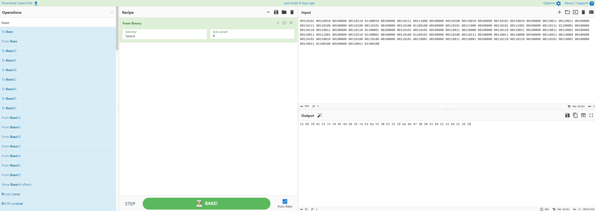
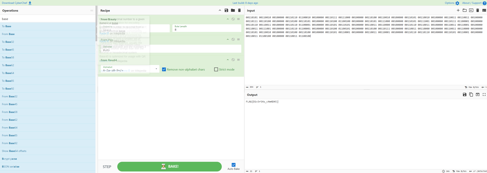

# Cebola Criptográfica (Escolinha CTF)

**Categoria:** Crypto  
**Autor:** Felipe Morais

## Introdução

O **Cebola Criptográfica** é um desafio da categoria Crypto presente na plataforma **Escolinha CTF**. O objetivo consiste em analisar um arquivo contendo dados codificados em múltiplas camadas consecutivas e remover cada uma delas até recuperar a flag original.

O desafio apresenta o conceito de codificação em camadas, também conhecido como *Onion Encoding*. Nesse modelo, o resultado de uma codificação é utilizado como entrada para outra, fazendo com que a informação original fique escondida sob diversas representações diferentes.

## Análise Inicial

O enunciado apresentado pelo desafio fornece uma pista sobre a existência de várias camadas:

> À primeira vista, parece apenas linguagem de máquina bruta, mas nossos analistas acreditam que o remetente empacotou a mensagem em várias camadas para burlar nossos filtros.

Também foram fornecidas as seguintes informações:

- Modelo de flag: `FLAG{...}`
- Arquivo anexado: `flag.txt`

Ao abrir o arquivo `flag.txt`, encontramos uma sequência formada por grupos de oito dígitos binários:

```text
00110101 00110010 00100000 00110110 01100010 00100000 ...
```

Cada grupo contém oito bits e representa um byte. Isso indica que a primeira camada pode ser removida convertendo os valores binários em texto.

## Interpretação

O nome **Cebola Criptográfica** sugere que a informação foi envolvida em várias camadas, que precisam ser removidas uma após a outra.

Apesar do nome do desafio utilizar o termo “criptográfica”, os formatos empregados são codificações reversíveis e não algoritmos de criptografia baseados em chaves secretas.

Ao analisar os padrões encontrados em cada etapa, formulamos a hipótese de que as camadas foram aplicadas na seguinte ordem:

```text
Flag → Base64 → Hexadecimal → Binário
```

Para recuperar a flag, seria necessário realizar o processo inverso:

```text
Binário → Hexadecimal → Base64 → Flag
```

A estratégia adotada foi:

1. Converter os grupos binários em texto.
2. Interpretar o resultado como valores hexadecimais.
3. Converter o hexadecimal em texto.
4. Identificar a string resultante como Base64.
5. Decodificar o Base64 para recuperar a flag.

## Resolução

### 1. Convertendo o binário

A sequência do arquivo `flag.txt` foi inserida no campo **Input** do CyberChef.

Em seguida, adicionamos à receita a operação:

```text
From Binary
```

A operação foi configurada com:

```text
Delimiter: Space
Byte Length: 8
```

Isso fez com que cada grupo de oito bits fosse interpretado como um byte.

O resultado foi a seguinte sequência hexadecimal:

```text
52 6b 78 42 52 33 74 45 4d 58 59 7a 63 6a 55 30 63 31 39 6a 4e 47 30 30 52 44 51 31 66 51 3d 3d
```



*Conversão da primeira camada com a operação `From Binary`.*

### 2. Convertendo o hexadecimal

O resultado da primeira etapa apresenta pares de caracteres compatíveis com uma representação hexadecimal.

Adicionamos então a operação:

```text
From Hex
```

O CyberChef interpretou cada par hexadecimal como um caractere e revelou a seguinte string:

```text
RkxBR3tEMXYzcjU0c19jNG00RDQ1fQ==
```


*Remoção da segunda camada com as operações `From Binary` e `From Hex`.*

A saída possui características típicas do formato Base64:

- utiliza letras e números;
- possui comprimento compatível com blocos Base64;
- termina com os caracteres de preenchimento `==`.

Essas características indicam que ainda existe uma camada a ser removida.

### 3. Decodificando o Base64

Para remover a última camada, adicionamos à receita a operação:

```text
From Base64
```

A receita completa ficou organizada da seguinte maneira:

```text
From Binary
From Hex
From Base64
```

Após aplicar as três operações sequencialmente, o CyberChef revelou o conteúdo original:

```text
FLAG{D1v3r54s_c4m4D45}
```



*Resultado final após remover as camadas de binário, hexadecimal e Base64.*

## Flag

```text
FLAG{D1v3r54s_c4m4D45}
```

## Conclusão

O desafio **Cebola Criptográfica** demonstra como uma informação pode ser escondida por meio da aplicação consecutiva de diferentes codificações.

A mensagem original foi submetida a três camadas:

```text
Flag → Base64 → Hexadecimal → Binário
```

Para recuperar o conteúdo, realizamos as operações inversas na ordem correta:

```text
Binário → Hexadecimal → Base64 → Flag
```

Embora a aplicação de várias camadas aumente a complexidade visual dos dados, formatos como binário, hexadecimal e Base64 não oferecem confidencialidade real. Essas representações são totalmente reversíveis e não dependem de uma chave secreta.

Em análises forenses e desafios de CTF, reconhecer os padrões de cada codificação permite determinar qual operação deve ser aplicada em seguida. Ao remover cada camada sequencialmente, foi possível recuperar a flag original.
