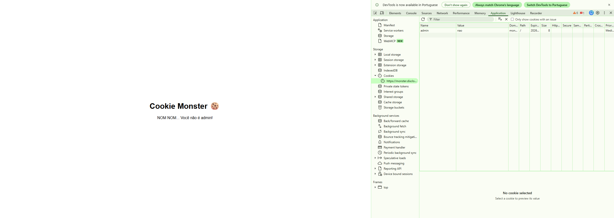
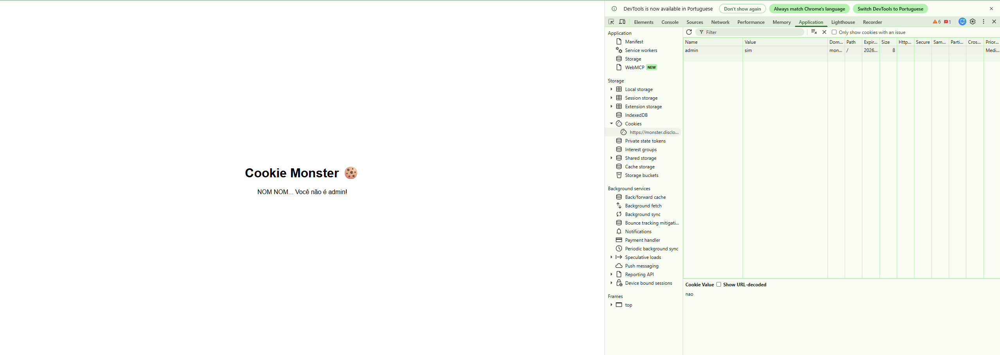

# Cookie Monster (Escolinha CTF)

**Categoria:** Web  
**Autor:** Felipe Morais

## Introdução

O **Cookie Monster** é um desafio da categoria Web presente na plataforma **Escolinha CTF**. O objetivo consiste em analisar o mecanismo de controle de acesso da aplicação e explorar uma manipulação de **cookies HTTP** para obter privilégios de administrador e acessar a flag.

O desafio introduz um conceito importante de segurança Web: informações controladas pelo navegador do usuário não devem ser utilizadas como mecanismo confiável de autorização sem que exista uma validação adequada no servidor.

## Análise Inicial

O enunciado apresentado pelo desafio é bastante simples:

> Acesse o site para obter a flag:
>
> Modelo de flag: `FLAG{...}`

Ao acessar a aplicação, a página informa que o usuário atual não possui privilégios de administrador necessários para visualizar a flag:

```text
NOM NOM... Você não é admin!
```

Como não são fornecidas credenciais ou outros mecanismos aparentes de autenticação, seria necessário investigar como a aplicação estava determinando o nível de privilégio do usuário.

O próprio nome do desafio, **Cookie Monster**, fornece uma pista importante: provavelmente seria necessário analisar os **cookies armazenados pelo navegador**.

## Interpretação

Cookies são pequenos conjuntos de dados que uma aplicação pode armazenar no navegador e que podem ser enviados novamente ao servidor durante requisições HTTP.

Ao analisar o comportamento da aplicação, levantamos a hipótese de que o controle de privilégios estava sendo realizado através de um valor armazenado diretamente em um cookie.

Caso a aplicação utilizasse uma estrutura como:

```text
admin=nao
```

e confiasse diretamente nesse valor para determinar se o usuário possuía privilégios administrativos, seria possível tentar modificar manualmente o cookie para:

```text
admin=sim
```

Como determinados cookies armazenados no navegador podem ser visualizados e modificados pelo próprio usuário, utilizar diretamente uma informação manipulável pelo cliente como mecanismo de autorização pode resultar em uma vulnerabilidade de **Broken Access Control**.

A hipótese, portanto, foi verificar os cookies existentes e procurar algum parâmetro relacionado ao privilégio administrativo.

## Resolução

### 1. Inspecionando os cookies

Com a aplicação aberta no navegador, pressionamos `F12` para acessar o **Developer Tools**.

Em seguida, navegamos até a aba **Application**, expandimos a seção **Cookies** no menu lateral e selecionamos o domínio da aplicação.

Ao analisar os cookies armazenados, encontramos um parâmetro chamado `admin`, cujo valor estava definido como:

```text
admin=nao
```

Ao mesmo tempo, a aplicação apresentava a mensagem:

```text
NOM NOM... Você não é admin!
```

Isso fortaleceu a hipótese de que esse cookie estava sendo utilizado para determinar o privilégio do usuário.



*Aplicação negando o acesso com o cookie `admin=nao`.*

### 2. Manipulando o valor do cookie

Como o cookie podia ser editado através do Developer Tools, alteramos manualmente seu valor.

O valor original:

```text
nao
```

foi substituído por:

```text
sim
```

O cookie passou, portanto, de:

```text
admin=nao
```

para:

```text
admin=sim
```

Nesse momento, a página ainda apresentava a mensagem de acesso negado, pois a alteração havia sido realizada apenas no cookie armazenado no navegador e uma nova requisição ainda precisava ser enviada à aplicação.



*Cookie alterado para `admin=sim`, antes do recarregamento da página.*

### 3. Recarregando a aplicação

Após modificar o cookie, recarregamos a página utilizando `F5`.

Na nova requisição, o navegador enviou o cookie atualizado:

```text
admin=sim
```

A aplicação aceitou o valor informado e passou a considerar a sessão como pertencente a um usuário com privilégios administrativos.

A mensagem anteriormente apresentada foi substituída por:

```text
NOM NOM NOM! DELÍCIA! Aqui está sua flag: FLAG{C00K1E_M0NST3R_MUNCH}
```

Dessa forma, conseguimos contornar o controle de acesso da aplicação e obter a flag.


*Aplicação exibindo a flag após receber o cookie `admin=sim`.*

## Flag

```text
FLAG{C00K1E_M0NST3R_MUNCH}
```

## Conclusão

O desafio **Cookie Monster** demonstra um problema clássico de **Broken Access Control**, no qual uma aplicação utiliza uma informação controlável pelo cliente para determinar privilégios de acesso.

Nesse caso, o controle podia ser contornado simplesmente modificando:

```text
admin=nao
```

para:

```text
admin=sim
```

e enviando uma nova requisição à aplicação.

O principal problema não está na utilização de cookies em si, já que eles são amplamente utilizados em aplicações Web, mas no fato de a aplicação **confiar em um valor manipulável pelo usuário para tomar uma decisão de autorização**.

Informações relacionadas a permissões e privilégios devem ser validadas de maneira segura no lado do servidor. Em aplicações baseadas em sessões, por exemplo, o navegador pode armazenar apenas um identificador de sessão, enquanto as informações de autorização permanecem associadas à sessão no servidor.

Quando informações de autorização precisam ser transportadas pelo cliente através de mecanismos como tokens, sua integridade deve ser protegida adequadamente para que qualquer tentativa de adulteração possa ser detectada pelo servidor.

O desafio reforça, portanto, um princípio fundamental da segurança Web: **dados controlados pelo cliente nunca devem ser considerados confiáveis para decisões de autorização sem validação adequada no servidor**.
